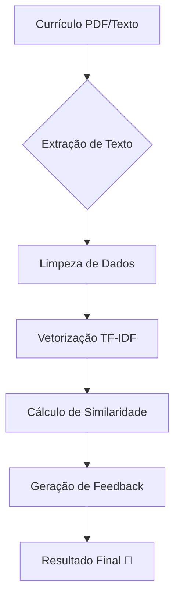

# 🤖 AI Analyzer: O Futuro da Análise de Currículos 🚀


Benvindo ao **AI Analyzer**! A ferramenta definitiva para transformar montanhas de currículos em seleções precisas e inteligentes. Desenvolvido com o que há de mais moderno em Processamento de Linguagem Natural (NLP), este projeto é seu novo melhor amigo no processo de recrutamento.

---

## 🌟 O que fazemos?

O AI Analyzer não apenas lê textos; ele **entende** a essência do candidato. Utilizando algoritmos de similaridade de cosseno e TF-IDF, ele compara currículos com descrições de vagas para entregar:

- ✅ **Match Score:** Uma nota de 0 a 100 de quão bem o candidato se encaixa.
- 🔍 **Keywords Tracking:** Identifica o que o candidato tem e o que está faltando.
- 💡 **Smart Feedback:** Sugestões reais para o candidato melhorar seu perfil.
- 📋 **Multicargos:** Suporte nativo para diversos cargos de tecnologia.

---

## 🛠️ Tecnologias de Elite

Nosso arsenal técnico:

- **FastAPI:** Velocidade relâmpago para nossa API.
- **NLTK & Scikit-learn:** O cérebro por trás da inteligência.
- **Pdfplumber:** Extração cirúrgica de texto de arquivos PDF.
- **Uvicorn:** Servidor ASGI de alta performance.

---

## 🚀 Como Decolar (Localmente)

### 1️⃣ Clone os Motores
```bash
git clone https://github.com/seu-usuario/ai-analyzer.git
cd ai-analyzer
```

### 2️⃣ Prepare o Combustível (Ambiente Virtual)
```powershell
python -m venv venv
.\venv\Scripts\activate
```

### 3️⃣ Instale os Módulos de Combate
```powershell
pip install -r requirements.txt
```

### 4️⃣ Inicie a Ignição
```powershell
uvicorn app.main:app --reload
```
Acesse: `http://127.0.0.1:8000/docs` para ver a magia acontecer!

---

## 🗺️ Mapa de Endpoints

### 🟢 `GET /health`
Verifica se o sistema está operante e saudável.

### 🔵 `GET /api/roles`
Lista todos os cargos suportados nativamente pelo sistema.

### 🔴 `POST /api/analyze`
Onde a mágica acontece. Envie um PDF ou texto para análise.

**Exemplo de Requisição (JSON):**
```json
{
  "job_role": "Backend Developer",
  "resume_text": "Desenvolvedor Python com 5 anos de experiência em FastAPI e SQL."
}
```

---

## 📈 Fluxo de Inteligência



---

## 🎨 Design Criativo & Senioridade

Este projeto foi refatorado para seguir os mais altos padrões de engenharia de software brasileira:
- 🇧🇷 **Comentários 100% em Português.**
- 🏗️ **Arquitetura modular e escalável.**
- 🛡️ **Testes automatizados robustos.**

---

Desenvolvido por João Ryan. Se gostou, deixe uma estrela! ⭐
